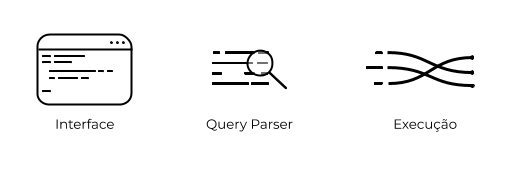

# 🖥️ Proto Terminal

     
Este projeto visa implementar um protótipo de terminal Unix para o curso de _Sistemas Operacionais_ da UFAM.

O proto teminal roda comandos básicos de um terminal como:

- **ls** ➡️ lista os elementos do diretório atual
- **cd** ➡️ troca o diretório atual
- **pwd** ➡️ imprime o caminho completo do diretório atual

Você pode executar seus programas chamando através do proto terminal e adcionar modificadores para a execução de processos: **>**,**<**,**|** e **&**

## Exemplos
Veja alguns cenários de execução de programas:

> **./prog1 ou prog1** – roda **prog1** normalmente
>
> **./prog1 arg1 arg2** – roda **prog1**  com 2 argumentos (**arg1** e **arg2**)
>
> **./prog1 &** – roda **prog1** e deixa o terminal livre para outros comandos.
>
> **./prog1 > saída** – roda **prog1** e joga o output dele para o arquivo saída
>
> **./prog1 < entrada** – roda **prog1** e recebe como input o arquivo entrada
>
> **./prog1 | ./prog2** – faz a saída de **prog1** ser a entrada de **prog2**

## ⚙️ Módulos

Este trabalho foi dividido em 3 partes, cada uma com suas responsabilidades dentro do projeto.
A **Interface** é responsável por mostrar ao usuário informações do estado do terminal e controlar as E/S dos programas. 
O **Query Parser** vai entender os comandos fornecidos e transcrever para as funções do terminal.
E por fim, a **Execução** das funções contruídas para o terminal funcionar.